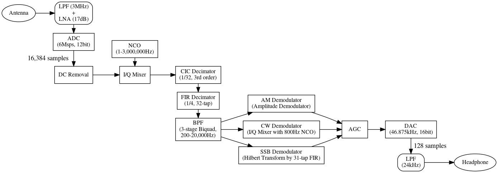
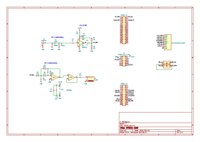
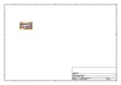
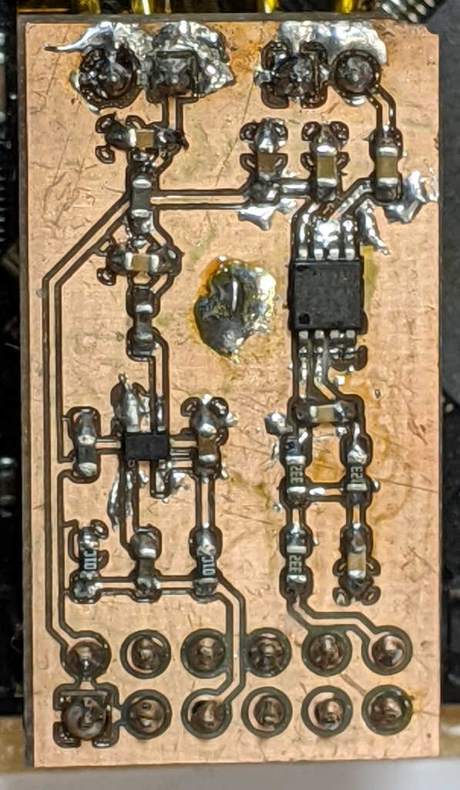
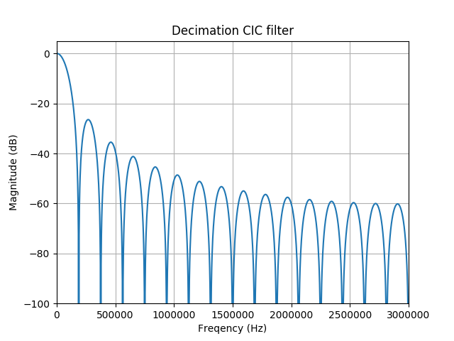
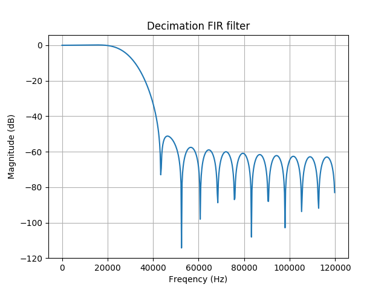
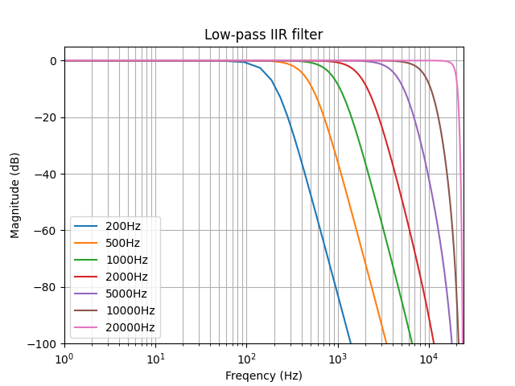
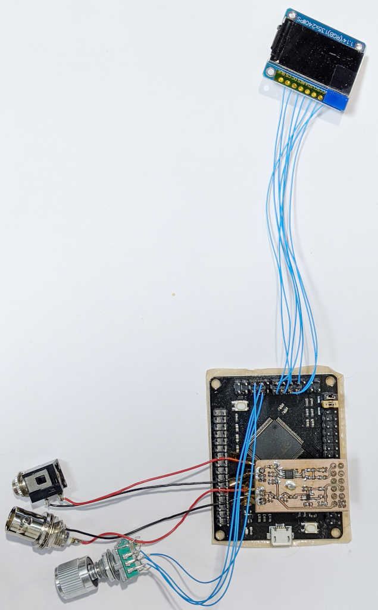
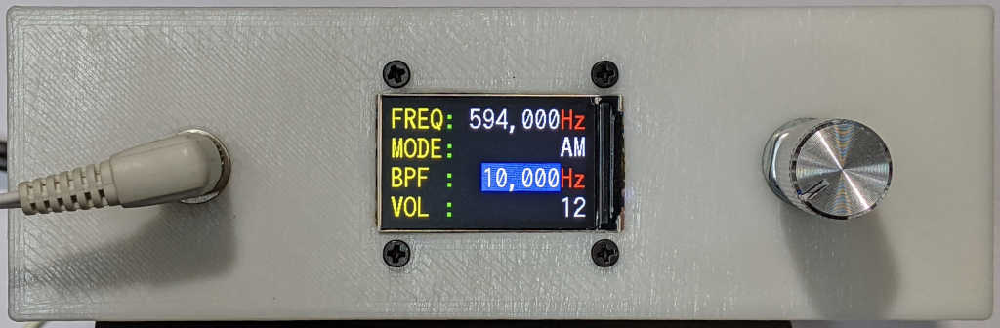
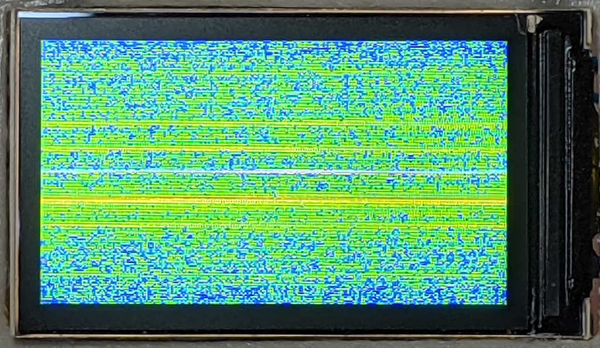

<!DOCTYPE html>
<html>
<body style="background-color: #ccccff;">
<!-- var -->

[English] <a href="#lang_ja">[日本語]</a>

<h1 align="center">Direct Sampling Software Defined Radio with STM32F4</h1>
<h2>Introduction</h2>

When I received long-wave JJY signals <a href="http&#58;//middleriver.chagasi.com/electronics/jjy.html">before</a>, an existing program of  Software Defined Radio (SDR) running on a PC and AD conversion with a USB TV tuner or sound card were used. I had always wanted to build an SDR entirely, so I made a standalone SDR using an STM32F4 microcontroller. It aims to be as much as simple with minimum parts.

The specification is as follows&#58;

<ul>
<li><strong>Receiving Frequency</strong>&#58; Up to 3 MHz (VLF/LF/MF)</li>
<li><strong>Modes</strong>&#58; AM, CW, SSB</li>
</ul>
<h2>Design</h2>
<h3>Overview</h3>

The STM32F407VGT6 microcontroller was chosen for making an SDR. This microcontroller has a built-in ADC with a maximum speed of 7.2 Msps and a floating-point unit (FPU). I used a microcontroller board from DIYMORE, which equips minimum necessary components such as a voltage regulator and a crystal oscillator. Arduino IDE (Arduino Core STM32) was used for developing the software. There is an approach for SDR which performs AD conversion and frequency conversion outside a microcontroller, but the direct sampling SDR was adopted here which performs all of these inside the microcontroller. This made the circuit simple.

Below is the block diagram of this SDR&#58;

First, the signal coming from the antenna goes into an external front-end circuit consisting of a low-pass filter and a low-noise amplifier before input to the microcontroller. In the microcontroller, the signal is first converted to a digital signal by an AD converter and the DC component is removed. The sampling frequency is 6 MHz at this point. Next, the signal of the desired frequency is extracted by an NCO (Numerically Controlled Oscillator) and an I/Q mixer (quadrature modulator). At this point, frequency components above the voice band are no longer needed, so they are converted to a lower sampling frequency by a CIC filter and an FIR filter (decimation processing). Finally, the sampling frequency is divided by 128 to 46.875 kHz. After unnecessary frequency band signals are removed by a band-pass filter, demodulation processing is performed for the AM/CW/SSB modes. The demodulated signal whose level is adjusted by the AGC is sent to the DA converter, and is played from the headphones after passing a low-pass filter.

It is efficient to process as much data as possible at once in this series of the steps, as it reduces overhead such as interrupt handling, but more buffering memory is required and the delay of the signal increases. In this SDR, due to the limitation of RAM, 16,384 samples of data are input to the ADC at once, and 128 samples of data are output from the DAC at once.

There already exist a similar direct sampling SDR named <a href="https&#58;//www.i2phd.org/armradio/index.html">ARM Radio</a> which uses a built-in ADC of a microcontroller. In ARM Radio, the ADC is operated at about 1.8 Msps, the decimation ratios by the CIC filter and FIR filter are 1/16 and 1/4 respectively, and the DAC frequency is 28 kHz. Compared to it, the SDR made here uses fixed-point arithmetic instead of floating-point arithmetic until the CIC decimation, and all processing is done in the time domain without converting to the frequency domain. SDR is an application of general digital signal processing, and the book Understanding Digital Signal Processing by Richard G. Lyons was useful in developing the program.

<h3>RF Front-end</h3>

The front-end section, where the signal from the antenna comes in, consists of a low-pass filter (LPF) to remove frequency components above the ADC's Nyquist frequency (3 MHz), and a low-noise amplifier (LNA) to amplify weak signals. BGA420 is used for the LNA, which is easy to obtain and requires few external components. It has relatively low noise and gain (17dB), and operates at 3.3 V.

The schematic, PCB layout, and completed board are shown below (this circuit includes not only the front-end section but also the output filter section).

<figure style="display: inline-table;"><a href="schematic.pdf"><figcaption>Schematic</figcaption></a></figure>
<figure style="display: inline-table;"><a href="pcb.pdf"><figcaption>PCB layout</figcaption></a></figure>
<figure style="display: inline-table;"><a href="fe_filter.jpg"><figcaption>Front-end and output filter board</figcaption></a></figure>

<h3>AD Conversion and DC Removal</h3>

The STM32F407 ADC can convert at a maximum of 2.4 Msps per channel. In this SDR, we operate it at 2 Msps and use triple interleaving to alternate between three channels to convert at a speed of 6 Msps. For running the ADC's internal clock at 30 MHz and performing signal sampling at 6 Msps using three ADCs, we need to convert every 3*30/6=15 clocks. The clocks necessary for the ADC resolution of 12 bits are 15 cycles, and the condition is fulfilled. One ADC occupies an input port for 5 cycles, therefore three ADCs can share one input port within 15 cycles. The converted data are transferred to memory by DMA in word units, and an interruption occurs when 16,384 samples are accumulated to start a series of processes up to the data transfer to the DAC. Since new data is converted by the ADC during subsequent processing, two buffers are prepared and switched so that the data from the ADC is stored in a buffer other than the buffer currently being processed.

The data input from the ADC has its DC removed by subtracting the offset value, and the average signal value is calculated to update the offset value.

<h3>NCO and I/Q Mixer</h3>

In this stage, a complex signal is obtained by performing frequency conversion using a complex mixer. This can be calculated by multiplying the input signal by the sine and cosine waves of the LO frequency, and they are generated in the NCO. The sine and cosine signals are calculated in advance and stored in a table, and are recalculated when the receive frequency is changed. The size of the NCO table is made the same as the size of the ADC buffer for efficient calculation. Therefore, the frequency is adjusted so that a multiple of the cycles of the receive frequency fits into the NCO table.

<h3>CIC and FIR Decimation Filter</h3>

In this stage, a decimation processing is performed for reducing the sampling frequency of the signal to a more manageable frequency. This is because frequencies above the audio frequency are no longer necessary after frequency conversion. The overall frequency is reduced to 1/128, first by applying the fast CIC filter for reducing to 1/32, then by applying the general FIR filter for reducing to 1/4. The CIC filter has three stages, and the FIR filter has 32 taps.

This decimation process increases the effective bits of the signal. In this case, the sampling frequency is reduced by a factor of 128 in total, so the resulting gain is SNR=(6.02 * N + 1.76)+10 log (R) = 95 dB, where N is the effective bits of the ADC (N=12) and R is the decimation ratio (R=128).

In this SDR, fixed-point arithmetic is used until this CIC filter, and floating-point arithmetic is used thereafter. Because STM32F4 equips an FPU, basic arithmetic can be calculated in the same clock (1 CPU cycle) as fixed-point arithmetic. Furthermore, floating-point arithmetic does not need the scaling required for fixed-point arithmetic, and more registers can be used, therefore using floating-point arithmetic is advantageous. The reason fixed-point arithmetic is used as well as floating-point arithmetic is that this CIC filter can be processed more efficiently with fixed-point arithmetic. The CIC filter can be implemented with simple integer addition and subtraction. Simply replacing it with floating-point arithmetic make the calculation results invalid. This is because the algorithm for integer CIC filters uses modulo arithmetic, and works well even if the integrator overflows. This does not mean that CIC filters cannot be implemented with floating-point arithmetic, and actually ARM Radio uses it. CIC filters can be expressed as FIR filters, for example, a third order CIC filter can be represented with a 4-tap FIR filter as follows&#58; (1+z^-1)^3=1+3z^-1+3z^-2+z^-3. However, it is less efficient compared to a CIC filter using integer arithmetic, and the integer CIC filter is used here for processing the signal as fast as possible.

The CIC filter has a comb-shaped stopband, and the FIR filter was designed to compensate for this, though it may have been unnecessary from the frequency response of the filter. The method for designing the FIR filter will be described later. The frequency responses of the CIC filter and FIR filter are shown below.

<figure style="display: inline-table;"><a href="filter_cic.png"><figcaption>CIC filter</figcaption></a></figure>
<figure style="display: inline-table;"><a href="filter_fir.png"><figcaption>FIR filter</figcaption></a></figure>

<h3>Band-pass Filter</h3>

The band-pass filter which extracts audio signals is implemented as a three-stage biquad filter. Low-pass filters of 200, 500, 1 k, 2 k, 5 k, 10 k, and 20 kHz can be selected.

I first tried to make a 6th order IIR filter but it was unstable, so the multi-stage biquad filter was chosen which was stable. FIR filters were not used since they were not enough shape. The sampling frequency of the signal is 46.875 kHz, which is unnecessarily high, so it is difficult to design filters for low frequencies.

ARM Radio does not process the band-pass filter in time space but in frequency space using FFT. This approach was interesting but needs the additional step for recovering to time space by using like the overlap-save method, and was not adopted.

This band-pass filter, as well as the previously mentioned FIR decimation filter and the Hilbert transform filter described later, was designed using the Python scipy package. The script used for designing the filters is available <a href="https&#58;//github.com/middle-river/stm32_sdr/tree/master/filter">here</a>. The frequency response of the band-pass filter is as follows&#58;

<figure style="display: inline-table;"><a href="filter_iir.png"><figcaption>Band-pass filter</figcaption></a></figure>

<h3>AM/CW/SSB Demodulation</h3>

Demodulation processing is performed here.

For AM signals, an envelope detector is used, which simply calculates the absolute value of the complex signal. AM signals can also be demodulated in the same way as SSB signals, but the results are affected by the shift in the carrier frequency. After demodulation, the DC component is removed.

For CW signals, demodulation is performed by frequency conversion for the tone frequency (800 Hz).

For SSB signals (USB or LSB), demodulation is performed by eliminating the frequency components on one side using the Hilbert transform. A 31-tap FIR filter is used for the Hilbert transform. In order to switch between USB and LSB demodulation, negated coefficients of the FIR filter are calculated in advance. There is also a way to perform the calculation by swapping the I/Q signals, but it is not applicable here due to a restriction of the memory allocation.

<h3>AGC and DA Conversion</h3>

The demodulated signal is transferred to the DAC buffer after adjusting the gain. The DAC is driven by a timer interrupt, and double buffering is used as in the ADC. The simple automatic gain control (AGC) is used where both the attack and hold times are zero.

<h3>Output Filter</h3>

An active filter using an op-amp (LMV358) removes unnecessary frequency components from the DAC output. The cutoff frequency is 24 kHz, which is slightly higher than the Nyquist frequency. This is because the DAC frequency was initially designed to be 48kHz. Please refer to the front-end section described before for the schematic.

LMV358 has rail-to-rail output swing capability, but the input range is about 0.0 to 2.5 V when operating at 3.3V, therefore the output is restricted by this range when operating at a gain of 1. Since the 12-bit DAC is used with a 3.3 V power supply, the DAC outputs 0.83 to 2.47V by swinging the output value within the range of 2048±1024.

<h3>Code Optimization</h3>

The completed code can be found in this GitHub repository. The main signal processing code is in the files DSP.h and DSP2.S. When developing the program, I first wrote straightforward code in C, then wrote optimized code in C. A sufficient speed was obtained at this point, but I was interested in how much faster it could be, and wrote it in assembly. By changing the value of OPTIMIZE_LEVEL in the DSP.h file to 0, 1, or 2, the non-optimized C version, the optimized C version, and the assembly version are chosen. The execution speed of each processing routine was measured, and the table below is the result (in microseconds).

<table align="center" border="1">
<tr>
<td align="left"><strong>Section</strong></td>
<td align="right"><strong>Non-optimized Version (C)</strong></td>
<td align="right"><strong>Optimized Version (C)</strong></td>
<td align="right"><strong>Optimized Version (Assembly)</strong></td>
</tr>
<tr>
<td align="left">DC Removal</td>
<td align="right">555</td>
<td align="right">198</td>
<td align="right">160</td>
</tr>
<tr>
<td align="left">I/Q Mixer and CIC Decimation</td>
<td align="right">2575</td>
<td align="right">839</td>
<td align="right">833</td>
</tr>
<tr>
<td align="left">FIR Decimation</td>
<td align="right">3734</td>
<td align="right">283</td>
<td align="right">122</td>
</tr>
<tr>
<td align="left">Band-pass Filter</td>
<td align="right">80</td>
<td align="right">61</td>
<td align="right">63</td>
</tr>
<tr>
<td align="left">AM Demodulation</td>
<td align="right">15</td>
<td align="right">12</td>
<td align="right">12</td>
</tr>
<tr>
<td align="left">CW Demodulation</td>
<td align="right">11</td>
<td align="right">6</td>
<td align="right">7</td>
</tr>
<tr>
<td align="left">SSB Demodulation</td>
<td align="right">597</td>
<td align="right">138</td>
<td align="right">55</td>
</tr>
<tr>
<td align="left">Total</td>
<td align="right">7565</td>
<td align="right">1538</td>
<td align="right">1257</td>
</tr>
</table>

The I/Q mixer is a simple process, and it is included in the same function as the CIC decimation for reducing the overhead. The measured time in the table is for processing 16,384 samples of a 6 Msps signal, so real-time processing is possible if it finishes within 1/(6 M/16384)=2730 μs, ignoring other overheads. The non-optimized code was slow, but it became fast enough just by improving the algorithm without using assembly. The size of the buffer used for input and output of each function is fixed, and simple loop unrolling assuming that the number of arrays is divisible by a specific number was effective. Some simple functions became slower by manually writing the assembly code. Looking at the results of the assembler version, the I/Q mixer and CIC decimation are the slowest, and the processing before reducing the number of samples is time consuming. FIR decimation is 13 times faster by optimizing the code. Below are shown the code before optimization (OPTIMIZE_LEVEL==0) and after optimization (OPTIMIZE_LEVEL==1). In the optimized FIR filter, unnecessary copy operations are avoided and the symmetry of the FIR filter is utilized by assuming that the number of input data is a multiple of 32. In the assembler version, memory access is reduced by using the floating-point registers which exist 32, the same as the number of the taps.

<pre style="background-color: #ccffcc">
static inline void decimator_fir(const float *coeff, float *state, int size, const float *inp, float *out) {
#if OPTIMIZE_LEVEL == 0
  for (int i = 0; i < size; i++) {
    for (int j = 31; j >= 1; j--) state[j] = state[j - 1];
    state[0] = inp[i];
    if (i % 4 == 3) {
      float acc = 0.0f;
      for (int j = 0; j < 32; j++) acc += coeff[j] * state[j];
      out[i / 4] = acc / (1 << 31);
    }
  }
#elif OPTIMIZE_LEVEL == 1
  float stt[32];
  for (int i = 0; i < 32; i++) stt[i] = state[i];
  for (int i = size / 32; i != 0; i--) {
    for (int j = 0; j < 8; j++) {
      for (int k = 0; k < 4; k++) stt[j * 4 + k] = *inp++;
      float acc = 0.0f;
      for (int k = 0; k < 16; k++) acc += coeff[k] * (stt[(j * 4 + 3 - k + 32) % 32] + stt[(j * 4 + 4 + k) % 32]);
      *out++ = acc / (1 << 31);
    }
  }
  for (int i = 0; i < 32; i++) state[i] = stt[i];
#elif OPTIMIZE_LEVEL == 2
  decimator_fir2(coeff, state, size, inp, out);
#endif
}
</pre>

The LDR/STR and VLDR/VSTR instructions were used frequently in the output of the C compiler. I modified them to use LDMIA/STMIA and VLDMIA/VSTMIA instructions which need only a half of CPU clocks to execute, but there was almost no difference. Looking closely at the data sheet, I realized that LDR/STR instruction requires less clocks when used consecutively. I also tried using LLVM/Clang for STM32 instead of gcc used in the Arduino Core STM32, but there was almost no difference in speed.

<h3>Clock Frequency of the Microcontroller</h3>

STM32F407VGT6 can generate a clock which is a multiple of 8 MHz up to 168 MHz using a PLL, but it is overclocked to run at 240 MHz. This is due to a restriction imposed by the ADC rather than processing speed. 15 ADC clock cycles are required when using the ADC with 12-bit resolution, and an ADC clock of 6 M*15/3=30 MHz is required when using triple interleave which alternates between three ADCs at 6 Msps. The ADC clock is generated from the APB2 clock using a divider (2, 4, 6, or 8), but since PCLK2 has a maximum of 85 MHz, it was set to 60 MHz. PCLK2 is generated from SYSCLK using the AHB prescaler (1, 2, 4, ..., or 512) and the APB2 prescaler (1, 2, 4, 8, or 16), which means that the only options for SYSCLK are 60 MHz, 120 MHz, and 240 MHz. There are several reports that the STM32F407 can operate without problems at 240MHz (<a href="http&#58;//sigalrm.blogspot.com/2014/01/overclocking-stm32f4.html">1</a>, <a href="https&#58;//community.st.com/s/question/0D50X00009Xki79/overclocking-stm32f4">2</a>), and 240 MHz was chosen here for this experimental project. I have no problems related to overclocking so far.

The configurations for the clock frequency and ADC are handled in the file Peripheral.cpp, and it was generated using the STM32CubeMX GUI.

<h3>Others</h3>

The interrupt priority is given to the DAC first, then the SysTick, and finally the ADC. The ADC has some timing leeway even if it is slightly delayed, but some functions like micros() will not work properly if the SysTick priority is low, and timing of the DAC is important to ensure smooth audio output.

STM32F4 has a RAM area (64 kB) called CCM. This area cannot be used for DMA, so it is used to store the NCO data.

The current code uses 3% of the flash memory and 57% of the RAM.

<h3>User Interface</h3>

This SDR has a 1.14-inch 240x135-dot LCD and a rotary encoder with a switch for operating it.

There are two modes, Information mode and Waterfall mode, and long-pressing the switch will alternate between the modes. In either mode, short-pressing the switch will change the selected item, and turning the switch clockwise or counterclockwise will increase or decrease the item's value, respectively. When setting the frequency, turning the switch quickly will change the value rapidly.

<ul>
<li>Information Mode</li>
<ul>
<li>Frequency (lower digits)</li>
<li>Frequency (higher digits)</li>
<li>Demodulation Mode</li>
<li>BPF Frequency</li>
<li>Volume</li>
</ul>
<li>Waterfall Mode</li>
<ul>
<li>Frequency</li>
<li>Hue</li>
<li>Waterfall Speed</li>
</ul>
</ul>

A 1 kHz timer interrupt is used to check input from the rotary encoder. Long-pressing and short-pressing are also recognized. A 16x32 font is used for the LCD, and is stored in ROM as a single image with the height of 16 pixels. <a href="https&#58;//github.com/middle-river/stm32_sdr/tree/master/font">This code</a> was used for converting the font data.

The waterfall plot is obtained with FFT from the signal after FIR decimation. It scrolls horizontally rather than vertically due to the restriction of the LCD buffer. A 5-color heat map is used for displaying. The signal strength needs to be converted to a logarithmic scale. Since precise conversion is not necessary, loop-unrolled binary search is used for looking up the index of a color palette with 64 colors.

<h2>Testing the Code</h2>

The signal processing code was debugged on a PC with various input signals. After programming the flash, I could successfully receive near AM stations using a few meters of wire as an antenna. However, long-wave JJY signals could not be received indoors.

This was my first time building an SDR, and there was some room for improvement. The baseband frequency (46.785 kHz) was relatively high, making it difficult to make a narrow filter. The output of the op-amp was weak, so only a small sound could be produced. The ADC sampling frequency was set to 6 MHz, but 7.2 MHz might have been better which could partially cover the 3.5 MHz band.

(Added on October 2021) An <a href="https&#58;//github.com/middle-river/jjy_sdr">SDR specially for long-wave JJY signals</a> was made.

<figure style="display: inline-table;"><a href="wired.jpg"><figcaption>Assembled board</figcaption></a></figure>
<figure style="display: inline-table;"><a href="finished.jpg"><figcaption>SDR in operation</figcaption></a></figure>
<figure style="display: inline-table;"><a href="waterfall.jpg"><figcaption>Waterfall plot</figcaption></a></figure>

<!-- var -->

<a href="#lang_en">[English]</a> [日本語]

<h1 align="center">STM32F4を使用したダイレクトサンプリング方式ソフトウェアラジオ</h1>
<h2>はじめに</h2>

以前<a href="http&#58;//middleriver.chagasi.com/electronics/jjy.html">長波のJJYを受信</a>しましたが，その時はワンセグチューナーやサウンドカードでAD変換を行いPC上で動くソフトウェアラジオ(SDR)を使用しました．SDRを丸ごと自作したいと前々から思っていたので，STM32F4マイコンを使用してスタンドアローンで動くSDRを作りました．できるだけ少ない部品でハードウェアはシンプルにすることを目指しました．

仕様は次のようになります&#58;

<ul>
<li><strong>受信周波数</strong>&#58; ～3MHz (VLF/LF/MF)</li>
<li><strong>電波形式</strong>&#58; AM, CW, SSB</li>
</ul>
<h2>設計</h2>
<h3>全体の構成</h3>

STM32F407VGT6マイコンを使ってSDRを作ることにしました．このマイコンは最大7.2MspsのADCや浮動小数点演算器(FPU)を内蔵しています．このマイコンを搭載したDIYMOREというブランドのマイコンボードを使用しました．このボードにはマイコンの他に電源レギュレータや水晶振動子など必要最低限の部品が載っています．ソフトウェアの開発にはArduino IDE (Arduino Core STM32)を使いましたが，このボードにはデフォルトで対応しています．SDRを実装する場合，AD変換と周波数変換をマイコンの外部で行う方式もありますが，今回はそれらをすべてマイコン内部で行うダイレクトサンプリング方式のSDRとしました．そのため外付け回路はかなりシンプルになります．

以下に，今回作成するSDRの構成図を示します&#58;

\	block.png

まずアンテナから入ってきた信号は，ローパスフィルタとローノイズアンプからなる外付けのフロントエンド回路を通過してマイコンに入力されます．マイコンでは最初にADコンバータでデジタル信号に変換してDC成分の除去を行います．この時点でサンプリング周波数は6MHzです．次に，NCO (Numerically Controlled Oscillator)とI/Qミキサー(直交変調器)により目的の周波数の信号を取り出します．この時点で音声帯域以上の周波数成分は不要となるので，CICフィルターとFIRフィルターにより低いサンプリング周波数に変換します(デシメーション処理)．最終的にサンプリング周波数は128分の1にされて46.875kHzとなります．そしてバンドパスフィルタにより不要な周波数帯域の信号を除去した後で，AM/CW/SSBの各電波形式に応じた復調処理を行います．復調された信号はAGCでレベル調整をした後でDAコンバータに送られ，ローパスフィルタを通してヘッドフォンから再生されます．

これらの一連の流れは，できるだけ多数のデータをまとめて処理した方が割り込み処理等のオーバーヘッドを削減できて効率的ですが，一方で必要なメモリが増えるとともに信号の遅延も大きくなります．今回はマイコンのRAMの都合で，ADCで一度に入力するデータは16,384サンプルとして，DACで一度に出力されるデータは128サンプルとなりました．

似たようにマイコン内蔵のADCを利用したダイレクトサンプリング方式のSDRとして，すでに<a href="https&#58;//www.i2phd.org/armradio/index.html">ARM Radio</a>というものがあります．ARM Radioの場合はADCは約1.8Mspsで，CICフィルタとFIRフィルタによるデシメーション比はそれぞれ1/16と1/4でDAC周波数は28kHzとなっていますが，他にもフィルターの実現方法などが本機とは異なっています．例えば，本機はCICデシメーションまでは浮動小数点演算ではなく固定小数点演算を使い，また一度も周波数領域へ変換せずにすべて時間領域で処理を行っています．SDRのコードを開発するにあたっては，SDR専用のアルゴリズムがあるのではなく基本的にデジタル信号処理の応用であり，特にUnderstanding Digital Signal Processing (Richard G. Lyons)という本が実践的な内容もあり詳しくて参考になりました．

<h3>フロントエンド部</h3>

アンテナからの入力が来るフロントエンド部は，ADCのナイキスト周波数(3MHz)より上の周波数成分を除去するためのローパスフィルタ(LPF)と，微弱信号を増幅するローノイズアンプ(LNA)から成っています．LNAは入手が容易で外付け部品も少ないBGA420を使用しました．このアンプはノイズもゲイン(17dB)もやや控えめで3.3Vで動作します．

回路図・配線図と完成した基板は下のようになりました(この回路にはフロントエンド部だけではなく出力フィルター部も含まれています)．

<figure style="display: inline-table;"><a href="schematic.pdf"><figcaption>回路図</figcaption></a></figure>
<figure style="display: inline-table;"><a href="pcb.pdf"><figcaption>配線図</figcaption></a></figure>
<figure style="display: inline-table;"><a href="fe_filter.jpg"><figcaption>入力アンプ・出力フィルター基板</figcaption></a></figure>

<h3>AD変換部・DC除去部</h3>

STM32F407のADCは1チャネル最大2.4Mspsで変換を行うことができますが，ここではそれを2Mspsで動作させ，3チャネルを交互に利用するトリプルインターリーブを使うことで6Mspsの速度で変換を行います．ADCの内部クロックを30MHzで動作させて6Mspsでサンプリングする場合，3つのADCを使うと3*30/6=15クロックごとに変換が必要となります．ADC分解能を12ビットとする場合変換に要するクロックは15サイクル必要となっているので間に合います．また1つのADCがポートを占有する時間は5サイクルとなっているので，15サイクルあれば3つのADCで1つの入力ポートを共有することができます．変換された値はDMAでword単位でメモリに転送し，16,384サンプルが貯まると割り込みを発生させて以降のDACへの転送までの一連の処理がトリガーされます．なお以降の処理を行う間も新たなデータがADCで変換されるため，バッファを2つ用意して切り替えることで，現在処理しているバッファとは別のバッファにADCからのデータを貯えるようにしています．

ADCから取り入れたデータは，オフセット値を差し引くことでDC除去をするとともに，信号の平均値を計算してオフセット値を更新します．

<h3>NCO・I/Qミキサー部</h3>

ここではいわゆる複素ミキサーにより周波数変換を行って複素信号を得ます．これは，LO周波数のsin波とcos波を入力信号に掛け算することで計算できますが，これらの信号を生成する部分がNCO部です．sin・cos信号はあらかじめ計算してテーブルに格納しておき，チューニング操作により受信周波数が変更されると再計算します．効率的に計算を行うため，NCOテーブルのサイズはADCバッファのサイズと同じにしました．そのため受信周波数の周期の整数倍がNCOテーブルに収まるように，周波数の端数を調整しています．

<h3>CIC・FIRデシメーションフィルタ部</h3>

ここでは，信号のサンプリング周波数を扱いやすい周波数に落とす，いわゆるデシメーション処理を行います．周波数変換を行った後なので音声周波数より上の周波数は不要になっているからです．全体で128分の1まで周波数を落としますが，最初にCICフィルターという高速だが特性に癖のあるフィルターで32分の1まで落し，次に汎用的なFIRフィルターで4分の1に落とします．CICフィルターは3段で，FIRフィルターは32タップとしました．

このようなデシメーション処理により信号の有効ビットを増やすことができます．ここでは合計で128分の1にサンプリング周波数を変換しているため，得られるゲインはNをADCの有効ビット(N=12)，Rをデシメーション比(R=128)としてSNR=(6.02 * N + 1.76)+10 log (R) = 95 dBとなります．

今回作成したSDRでは，このCICフィルターまでは固定小数点演算を使用し，それ以降は浮動小数点演算を使用しています．STM32F4はFPUを搭載しているため，基本的な演算は浮動小数点も固定小数点と同じクロック(1 CPUサイクル)で計算できます．その上浮動小数点演算は，固定小数点演算で必要な位取りを考慮する必要がなく，またより多くのレジスタを使うことができるので，できるだけ浮動小数点演算を使いたいところです．今回中途半端に固定小数点演算を併用した理由は，このCICフィルターは固定小数点演算の方が効率的に処理できるからです．詳細は省略しますが，CICフィルターは単純な整数の加算と減算で実装することができます(そのためFPGA等での実装にも適しています)．しかしながら，それをそのまま浮動小数点演算に置き換えると計算結果がおかしくなります．これは整数用CICフィルターのアルゴリズムはmodulo演算を仮定していて，積分器でオーバーフローが起きても整数の場合は問題がないためです．浮動小数点でCICフィルターが実装できないわけではありません．実際にARM Radioでは浮動小数点を使っています．CICフィルターはFIRフィルターとして表現することができて，例えば3次のCICフィルターは次のような4タップのFIRフィルターで実現できます&#58; (1+z^-1)^3=1+3z^-1+3z^-2+z^-3．しかしながら整数演算によるCICフィルターに比べてどうしても計算効率が落ちるため，サンプル数が多く実時間処理のボトルネックになる可能性があるこの段階ではできるだけ高速な整数用CICフィルターを使うことにしました．

CICフィルターは櫛形の特徴的な特性があるため，FIRフィルターではそれを補正するように設計しましたが，FIRフィルターの特性を見るかぎりあまり影響はなかったようなので不要だったかもしれません．FIRフィルターの設計方法については後述のバンドパスフィルター部で述べます．以下にCICフィルターとFIRフィルターの特性を示します．

<figure style="display: inline-table;"><a href="filter_cic.png"><figcaption>CICフィルター</figcaption></a></figure>
<figure style="display: inline-table;"><a href="filter_fir.png"><figcaption>FIRフィルター</figcaption></a></figure>

<h3>バンドパスフィルター部</h3>

必要な音声帯域の信号を抜き出して聴きやすくするためのバンドパスフィルターを3段のbiquad (双2次)フィルターで実装しています．200, 500, 1k, 2k, 5k, 10k, 20kHzのローパスフィルターを選べるようにしています．

最初は6次のIIRフィルターで設計しようとしましたが不安定だったので，biquadフィルターを多段で使うことにしたら安定しました．FIRフィルターだと特性が緩やかすぎたので使いませんでした．処理する信号のサンプリング周波数が46.875kHzと必要以上に高いので，低い周波数のフィルターを作るのは難しくなります．

なおARM Radioではバンドパスフィルターを時間空間で処理するのではなく，FFTで変換して周波数空間で処理しています．このアプローチにも興味があったのですが，最終的にoverlap-save法などで時間空間に戻す必要があり少し面倒になりそうなのでここでは採用しませんでした．

このバンドパスフィルター，および前述のFIRデシメーションと後述のヒルベルト変換のフィルターはPythonのscipyパッケージを使って設計しました．設計に使ったスクリプトは<a href="https&#58;//github.com/middle-river/stm32_sdr/tree/master/filter">ここ</a>にあります．バンドパスフィルターの特性は下のようになりました．

<figure style="display: inline-table;"><a href="filter_iir.png"><figcaption>バンドパスフィルター</figcaption></a></figure>

<h3>AM・CW・SSB復調部</h3>

ここでは，電波形式に応じた復調処理を行います．

AM信号の場合はエンベロープ復調を使いました．これは単純に複素信号の絶対値を計算するだけです．AM信号は理論的にはSSBと同じ方法で復調することもできますが，キャリア周波数のずれの影響を大きく受けてしまします．復調後に直流成分の除去を行っています．

CW信号の場合は，トーン周波数(ここでは800Hz)だけ周波数変換を行うことで復調しました．

SSB信号(USBまたはLSB)の場合は，ヒルベルト変換により片側の周波数成分を消すことで復調しました．ヒルベルト変換には31タップのFIRフィルターを使いました．USBとLSB復調の切り替えは，FIRフィルターの係数にマイナスを掛けたものをあらかじめ計算しておきそれを使いました．I/Q信号を入れ替えて計算する方法もありますが，今回はメモリ配置の都合でその手が使えませんでした．

<h3>AGC部・DA変換部</h3>

復調後の信号は，ゲインを調整してからDACのバッファに転送します．DACはタイマー割り込みで駆動して，ADC同様に2つのバッファを切り替えて使用します．自動ゲイン調整(AGC)は簡易的なもので，アタック時間もホールド時間もゼロとしています．

<h3>出力フィルター部</h3>

オペアンプ(LMV358)を使ったアクティブフィルターでDACの出力の余計な周波数成分を除去します．カットオフ周波数が24kHzとナイキスト周波数よりやや高めなのは，最初はDAC周波数を48kHzで設計していたためです．回路図等は前述のフロントエンド部を参照して下さい．

LMV358は出力はフルスイング可能ですが，入力範囲は3.3V動作時に0.0〜2.5V程度となっており，ゲイン1で動作させる場合は入力側の電圧範囲の制約を受けます．3.3Vの電源で12bit DAC出力なので，出力値を2048±1024の範囲に振ることで0.83〜2.47VをDACから出しています．

<h3>プログラムの最適化</h3>

作成したプログラムはこのGitHubリポジトリに置いてあります．SDRのメインとなる信号処理はDSP.hとDSP2.Sというファイルにあります．プログラムを開発するにあたり，まずは直接的でシンプルなコードをC言語で書き，次にアルゴリズムを工夫して最適化したコードをC言語で書きました．この時点で実用的な速度が得られましたが，どれだけ速くできるか興味があったのでさらにアセンブラでも書いてみました．DSP.hファイル中のOPTIMIZE_LEVELの値を0, 1, 2に変えることで，これらのC言語非最適化版，C言語最適化版，アセンブラ最適化版のコードを切り替えることができます．各処理ルーチンの実行速度を測定した結果次のようになりました(単位はマイクロ秒)．

<table align="center" border="1">
<tr>
<td align="left"><strong>処理</strong></td>
<td align="right"><strong>非最適化版(C言語)</strong></td>
<td align="right"><strong>アルゴリズム最適化版(C言語)</strong></td>
<td align="right"><strong>アルゴリズム最適化(アセンブラ)</strong></td>
</tr>
<tr>
<td align="left">DC除去</td>
<td align="right">555</td>
<td align="right">198</td>
<td align="right">160</td>
</tr>
<tr>
<td align="left">I/QミキサーとCICデシメーション</td>
<td align="right">2575</td>
<td align="right">839</td>
<td align="right">833</td>
</tr>
<tr>
<td align="left">FIRデシメーション</td>
<td align="right">3734</td>
<td align="right">283</td>
<td align="right">122</td>
</tr>
<tr>
<td align="left">バンドパスフィルター</td>
<td align="right">80</td>
<td align="right">61</td>
<td align="right">63</td>
</tr>
<tr>
<td align="left">AM復調</td>
<td align="right">15</td>
<td align="right">12</td>
<td align="right">12</td>
</tr>
<tr>
<td align="left">CW復調</td>
<td align="right">11</td>
<td align="right">6</td>
<td align="right">7</td>
</tr>
<tr>
<td align="left">SSB復調</td>
<td align="right">597</td>
<td align="right">138</td>
<td align="right">55</td>
</tr>
<tr>
<td align="left">全体</td>
<td align="right">7565</td>
<td align="right">1538</td>
<td align="right">1257</td>
</tr>
</table>

I/Qミキサー部はシンプルな処理なので，オーバーヘッドを減らすためCICデシメーションと同じ関数で処理しています．上記の時間は6Mspsの信号の16,384サンプルを処理するのに要する時間なので，その他の処理時間を無視すれば1/(6M/16384)=2730μsに収まれば実時間で処理できることになります．さすがに何も工夫せずに直接的に実装した場合は遅いですが，アルゴリズムを改良するだけで十分に高速になりました．各関数の入出力に使うバッファのサイズは固定なので，配列数が特定の数で割りきれることを仮定した単純なループ展開も一部で効果がありました．STM32の能力では，アセンブラを使って徹底的にチューニングしなければ厳しいかと思っていましたが，アルゴリズムの工夫だけで大きな性能改善を得ることができてやや拍子抜けでした．単純な関数だと，下手に手で書く方がやや遅いケースもあります．一番高速なアセンブラ版の結果を見ると，I/QミキサーとCICデシメーションの処理が一番遅く，やはりサンプル数を減らす前の処理が一番重たいことが分かります．FIRデシメーションはアルゴリズムの最適化により13倍高速になっています．以下に，最適化前(OPTIMIZE_LEVEL==0)と最適化後(OPTIMIZE_LEVEL==1)のコードを示します．最適化したFIRフィルターの処理では，入力データの個数が32の倍数であることを仮定して，無駄なコピー操作が生じないようにするとともにFIRフィルターの対称性も利用しています．なおアセンブラ版では，浮動小数点レジスタがタップ数と同じ32個あるので，できるだけメモリアクセスを行わないようにしています．

<pre style="background-color: #ccffcc">
static inline void decimator_fir(const float *coeff, float *state, int size, const float *inp, float *out) {
#if OPTIMIZE_LEVEL == 0
  for (int i = 0; i < size; i++) {
    for (int j = 31; j >= 1; j--) state[j] = state[j - 1];
    state[0] = inp[i];
    if (i % 4 == 3) {
      float acc = 0.0f;
      for (int j = 0; j < 32; j++) acc += coeff[j] * state[j];
      out[i / 4] = acc / (1 << 31);
    }
  }
#elif OPTIMIZE_LEVEL == 1
  float stt[32];
  for (int i = 0; i < 32; i++) stt[i] = state[i];
  for (int i = size / 32; i != 0; i--) {
    for (int j = 0; j < 8; j++) {
      for (int k = 0; k < 4; k++) stt[j * 4 + k] = *inp++;
      float acc = 0.0f;
      for (int k = 0; k < 16; k++) acc += coeff[k] * (stt[(j * 4 + 3 - k + 32) % 32] + stt[(j * 4 + 4 + k) % 32]);
      *out++ = acc / (1 << 31);
    }
  }
  for (int i = 0; i < 32; i++) state[i] = stt[i];
#elif OPTIMIZE_LEVEL == 2
  decimator_fir2(coeff, state, size, inp, out);
#endif
}
</pre>

ところで，Cコンパイラが出力したアセンブラリストを見るとLDR/STRやVLDR/VSTR命令が多用されていました．LDMIA/STMIAやVLDMIA/VSTMIA命令をうまく使えば必要なクロック数がほぼ1/2になり高速になるかと思いましたがほとんど変わりませんでした．データシートをよく見ると，LDR/STR命令などは単体では2クロック必要でも，例えば3連続で行えば4クロックで実行できるため差は出ないことが分かりました．なお，Arduino Core STM32で使われるgccの代わりにSTM32用のLLVM/Clangも使ってみましたが，速度はほとんど変わりませんでした．

<h3>マイコンのクロック周波数</h3>

使用したマイコンのSTM32F407VGT6は水晶発振子8MHzの倍数クロックをPLLで生成することができて，最大クロック周波数は168MHzとなっていますが，オーバークロックして240MHzで動かしています．これは処理速度のためというよりもADCによる制約のためです．12bit分解能でADCを行う場合15 ADCクロックサイクルが必要になり，6Mspsで3つのADCを交互に使うトリプルインターリーブを用いると6M*15/3=30MHzのADCクロックが必要になります．ADCクロックはAPB2クロックから分周器(2, 4, 6, 8分周のいずれか)で作りますがPCLK2は最大85MHzとなっているため60MHzとします．PCLK2はSYSCLKからAHBプリスケーラ(1, 2, 4, ..., 512分周)とAPB2プリスケーラ(1, 2, 4, 8, 16分周)で作りますが，そうなるとSYSCLKの選択肢は60MHz, 120MHz, 240MHzしかありません．一方でSTM32F407は240MHzでも問題なく動作したという報告がいくつかある(<a href="http&#58;//sigalrm.blogspot.com/2014/01/overclocking-stm32f4.html">1</a>, <a href="https&#58;//community.st.com/s/question/0D50X00009Xki79/overclocking-stm32f4">2</a>)ので，今回はもともと実験的な用途ということもあり240MHzで動作させることにしました．今のところオーバークロックが原因と思われる問題は起きていません．

クロックやADCなどのマイコンの設定はPeripheral.cppというファイルで行っていますが，STM32CubeMXのGUIを使ってソースファイルを生成して利用しました．

<h3>ソフトウエアに関するその他</h3>

割り込みの優先度は，DACを最優先とし，次にSysTick，最後にADCとしています．ADCは多少遅れてもタイミングに余裕がありますが，SysTickの優先度が低いとmicros()などが正常に動かなくなり，またDACはスムーズな音声出力のためにタイミング管理が重要となります．

STM32F4はCCMというRAM領域が(64kB)あります．この領域はDMAには使えないので，NCOデータの置き場所に使っています．

現状のコードでは，フラッシュメモリのうち3%を，RAMのうち57%を使用しています．

<h3>ユーザーインターフェース</h3>

SDRを操作するために，1.14インチの240x135ドットの液晶とスイッチ付きロータリーエンコーダを付けています．

InformationモードとWaterfallモードがあり，スイッチを長押しするとモードを交互に切り替えます．どちらのモードでも，スイッチを短押しすると選択中の項目を切り替え，右回転と左回転でそれぞれ項目の値を増加したり減少したりします．周波数設定時は早く回すと値を高速変化します．

<ul>
<li>Informationモード</li>
<ul>
<li>周波数(下位桁)</li>
<li>周波数(上位桁)</li>
<li>復調モード</li>
<li>BPF周波数</li>
<li>音量</li>
</ul>
<li>Waterfallモード</li>
<ul>
<li>周波数</li>
<li>色相</li>
<li>表示速度</li>
</ul>
</ul>

キー入力は，1kHzのタイマー割り込みでロータリーエンコーダからの入力を調べます．スイッチが押された場合長押しか短押しかの判定もします．LCDのフォントは扱いやすさを考えて16x32としました．高さ16ピクセルの一つの画像としてROMに格納しました．フォントデータ変換に使ったコードは<a href="https&#58;//github.com/middle-river/stm32_sdr/tree/master/font">ここ</a>にあります．

ウォーターフォール表示は，FIRデシメーション直後の信号をFFT変換して使っています．本当は垂直にスクロールしたいところですが，使用したLCDのバッファの都合で水平にスクロールしています．表示には5カラーのヒートマップを使いました．信号強度は対数に変換して表示する必要がありますが，log関数を実装するのが面倒だったのと，どうせ細かい色は目で区別できないので64色のカラーパレットがあれば充分と考えたため，ループ展開した二分探索でカラーパレットのインデックスを見つけるコードを書きました．SDRの処理が思ったよりも軽かったため，ウォーターフォール表示の処理も苦労せずに行えました．

<h2>動作テスト</h2>

信号処理のコードは，色々な入力信号に対する出力をPC上でシミュレーションしてデバッグしていました．そのおかげかSTM32に書き込んで動作させたところ，一発でAM放送の受信に成功しました．数メートルのコードをアンテナとして使い，近隣のAM放送局をいくつか試したところ受信できました．しかし長波JJYは室内で試した限り受信できませんでした．CWとSSBモードに関しては，シミュレーションで復調のテストを行っただけで実際の電波を受信してのテストはまだしていません．

今回初めてSDRを自作しましたが，実用性に関しては色々と問題があります．まずベースバンド周波数(46.785kHz)が比較的高いために，狭いフィルターを実現するのが困難になってしまいました．また出力段のオペアンプの出力が弱く，小さい音しか出せません．ADCのサンプリング周波数はキリがよい6MHzとしましたが，7.2MHzまで可能なのでその方が3.5MHzバンドを一部カバーできてよかったかもしれません．

(2021年10月追記) これらの問題を踏まえて，<a href="https&#58;//github.com/middle-river/jjy_sdr">JJY専用のソフトウェアラジオ</a>を作成しました．

<figure style="display: inline-table;"><a href="wired.jpg"><figcaption>配線後の基板</figcaption></a></figure>
<figure style="display: inline-table;"><a href="finished.jpg"><figcaption>使用中の様子</figcaption></a></figure>
<figure style="display: inline-table;"><a href="waterfall.jpg"><figcaption>ウォーターフォール表示</figcaption></a></figure>

<a href="https&#58;//github.com/middle-river">[Home]</a>

2020-11 Project finished. 2021-04-10 Page created. 2021-10-17 Code modified. T. Nakagawa

</body>
</html>
